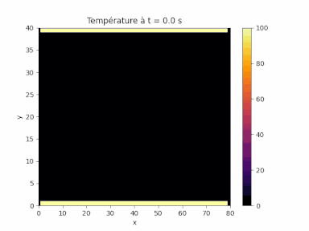
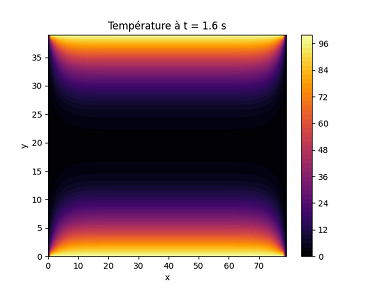

## Résolution numérique de l'équation de la chaleur

 

Un programme codé en Python pour résoudre l'équation de la chaleur à deux dimensions.

### Aperçu

  
  

### Théorie

*En construction*

### Bibliographie

*En construction*
